# EQ4 to GoTo Mount Conversion using OnStepX

Converting a manual Skywatcher EQ4 equatorial mount into a fully computerized GoTo mount using [OnStepX](https://github.com/hjd1964/OnStepX) firmware on an ESP32 microcontroller.

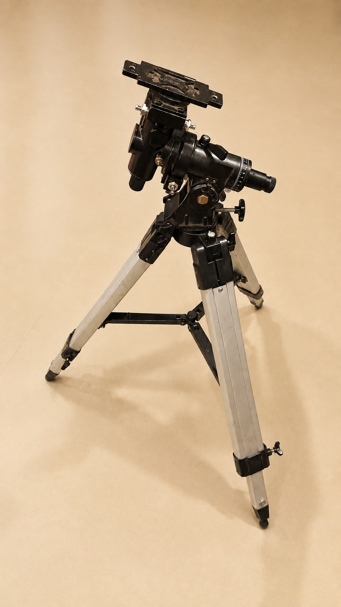

## Overview

[OnStepX](https://github.com/hjd1964/OnStepX) is an open-source, computerized GoTo controller for telescope mounts, built around stepper motors. It supports both Equatorial and Alt/Az mounts and runs on a range of microcontrollers (ESP32, STM32 Blue Pill/Black Pill, Fysetc boards, Teensy, etc.).

This project documents converting a stock **EQ4 equatorial mount** into a GoTo mount using an **ESP32**, custom-built stepper driver electronics, and a 3D-printed mount for the electronics. It covers everything from flashing the firmware to designing a custom PCB to machining brackets for motors that the mount was never designed to hold.

> **Note:** This is a personal build log, not an official OnStepX guide. Some steps (such as pin assignments and gear ratios) are specific to this hardware combination and may need to be adapted for other mounts or driver boards.

## Table of Contents

- [Bill of Materials](#bill-of-materials)
- [Step 1: Flashing OnStepX Firmware to the ESP32](#step-1-flashing-onstepx-firmware-to-the-esp32)
- [Step 2: Connecting the ESP32 to the OnStep Controller App](#step-2-connecting-the-esp32-to-the-onstep-controller-app)
- [Step 3: Choosing a Motor Driver and Setting Vref](#step-3-choosing-a-motor-driver-and-setting-vref)
- [Step 4: Breadboard Testing](#step-4-breadboard-testing)
- [Step 5: Designing a Custom PCB](#step-5-designing-a-custom-pcb)
- [Step 6: Firmware Configuration](#step-6-firmware-configuration)
- [Step 7: Setting Up the Web Server Plugin](#step-7-setting-up-the-web-server-plugin)
- [Step 8: Servicing the Mount and Fitting Motor Brackets](#step-8-servicing-the-mount-and-fitting-motor-brackets)
- [Safety Notes](#safety-notes)
- [Credits](#credits)
- [Additional Photos & Videos](#additional-photos--videos)
- [Status / Next Steps](#status--next-steps)
- [Note](#Note)


## Bill of Materials

| Component | Notes | Link |
|---|---|---|
| Digital Multimeter | For voltage/continuity checks | [Link](https://robu.in/product/digital-multimeter-small-yellow-color-lcd-ac-dc-measuring-voltage-current/) |
| Breadboard (840 tie points) | For initial circuit testing | [Link](https://robu.in/product/breadboard-840-tie-points-solderless-diy-project-circuit-test-breadboard) |
| ESP32 (ESP-WROOM-32) | Main microcontroller | [Link](https://robu.in/product/esp-wroom-32-esp32-wifi-bt-ble-mcu-module) |
| NEMA17 Stepper Motor | 200 steps/rev, one per axis | [Link](https://robu.in/product/nema17-pr42hs40-1204af-02-4-2kg-cm-stepper-motor-d-type-shaft) |
| DRV8825 Motor Driver | One per axis (see [driver comparison](#step-3-choosing-a-motor-driver-and-setting-vref)) | [Link](https://robu.in/product/drv8825-stepper-motor-driver-with-aluminum-heat-sink) |
| Electrolytic Capacitor (100µF, 50V) | Protects driver from voltage spikes | [Link](https://robu.in/product/100uf-50v-20-chip-type-aluminum-electrolytic-capacitor-smt-pack-of-5) |
| Jumper Cables (M2M) | Breadboard wiring | [Link](https://robu.in/product/male-to-male-jumper-wires-40pcs-20cm) |
| Power Source: 12V, 2A (or 12V, 5A) | 2A is sufficient for testing; upgrade to 5A if needed | [2A](https://robu.in/product/ntl-orange-12vol-2amp-3pin-wall-mount-type-adapter) · [5A](https://robu.in/product/orange-ac-100-240v-to-dc-12v-5a-60w-power-adapter/) |
| Active Buzzer | Status indication | [Link](https://robu.in/product/5v-active-electromagnetic-buzzer-pack-of-5) |
| Step-Down Buck Converter | Steps 12V down to 5V for the driver FLT pin | [Link](https://robu.in/product/mini-360-step-down-buck-converter-power-module) |
| 4-Pin Aviation Connectors | Detachable motor/power connections | [Link](https://robu.in/product/gx-16-4-pin-metal-aviation-plug-male-and-female-panel-connector/) |
| L-shaped brackets (NEMA17) | Mounting motors to the axes | [Link](https://roboticsdna.in/product/bracket-for-nema-17-stepper-motor/) |
| GT2 Pulleys (60T & 12T) | 5:1 gear ratio | [60T](https://robu.in/product/gt2-6mm-belt-width-60-teeth-5mm-bore-aluminium-timing-pulley/) · [12T](https://thinkrobotics.com/products/gt2-timing-pulley?_pos=1&_sid=6cd249838&_ss=r) |
| GT2 Timing Belt | Closed-loop, 180mm | [Link](https://www.superbtech.in/product/180mm-gt2-closed-loop-rubber-timing-belt-6mm-width-for-3d-printer-cnc) |

---

## Step 1: Flashing OnStepX Firmware to the ESP32

1. Download the OnStepX firmware from the [official GitHub repository](https://github.com/hjd1964/OnStepX) — use the **`main`** branch for the latest configuration. Latest version for this build: **10.28**.

   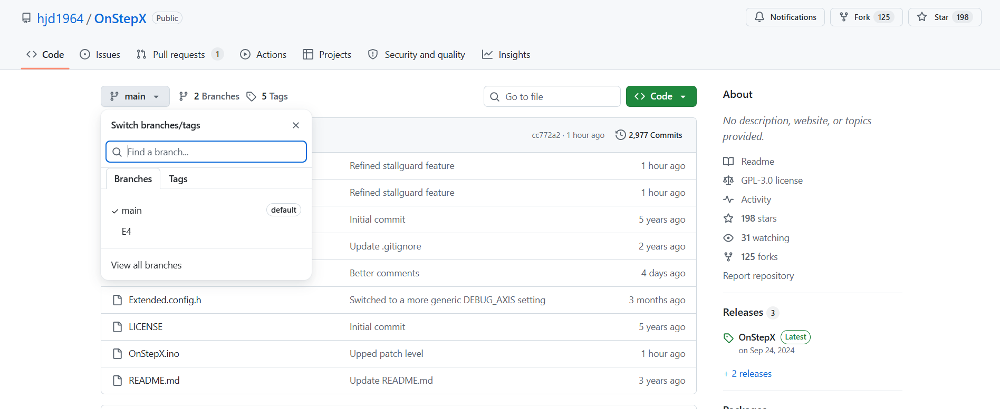
   *Credits: [hjd1964](https://github.com/hjd1964)*

2. Unzip the downloaded file (it extracts as `OnStepX-main`) and rename the folder to **`OnStepX`**.

3. Open the folder — it should contain the following files:

   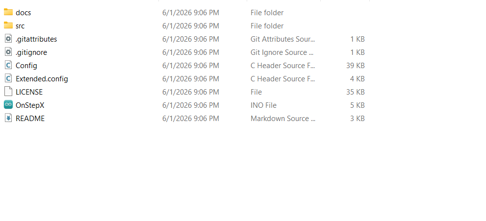

4. Open the **`OnStepX.ino`** file. This launches Arduino IDE along with the `Config.h` and `Extended.config.h` files alongside it.

   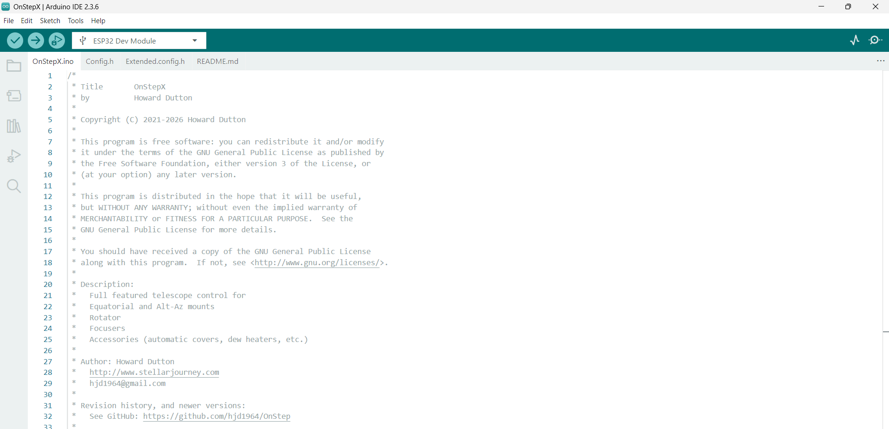

   If you don't have Arduino IDE installed, download it from the [official website](https://arduino-ide.org/).

5. **Install the ESP32 USB driver.** The ESP32 dev board uses a CP210x USB-to-UART chip, which needs an external driver on most systems. Follow [this driver installation guide](https://github.com/AnnemHarshaVardhan1811/Install-ESP32-ESP8266-USB-Drivers-CP210x-USB-to-UART-Bridge-Windows-PC-) if needed.

6. **Add the ESP32 board package to Arduino IDE:**
   - Go to **File**

     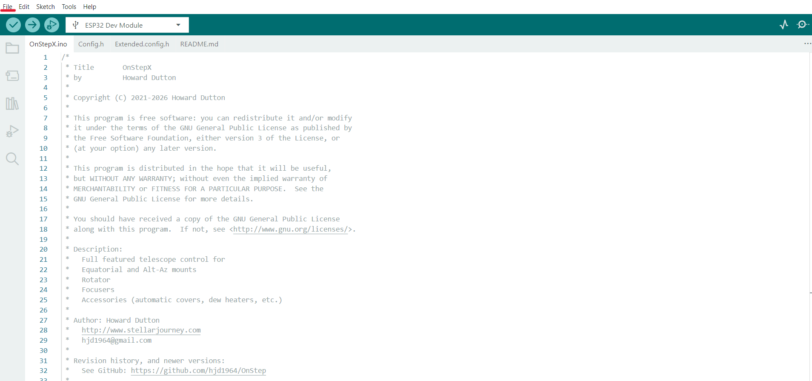

   - Go to **Preferences**

     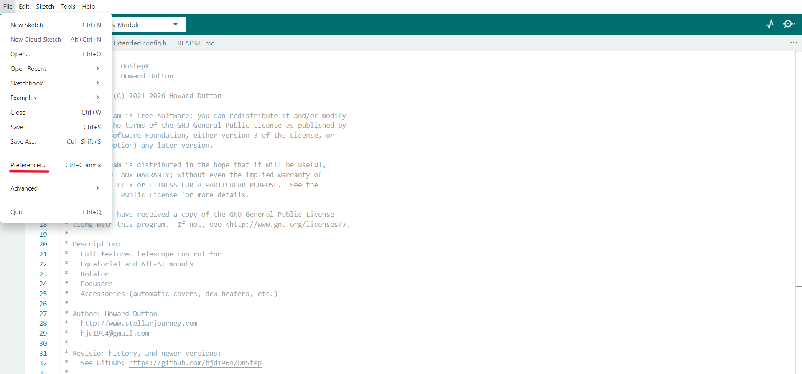

   - In the Preferences window, paste the following URL into **Additional Boards Manager URLs**, then click **OK**:

     ```
     https://raw.githubusercontent.com/espressif/arduino-esp32/gh-pages/package_esp32_index.json
     ```

     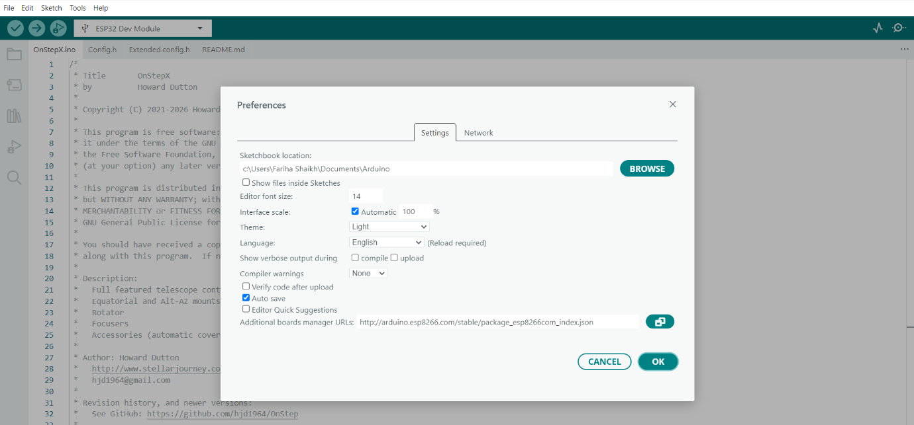

7. **Select the board and port.** Click the board/port dropdown and choose **"Select other board and port"**.

   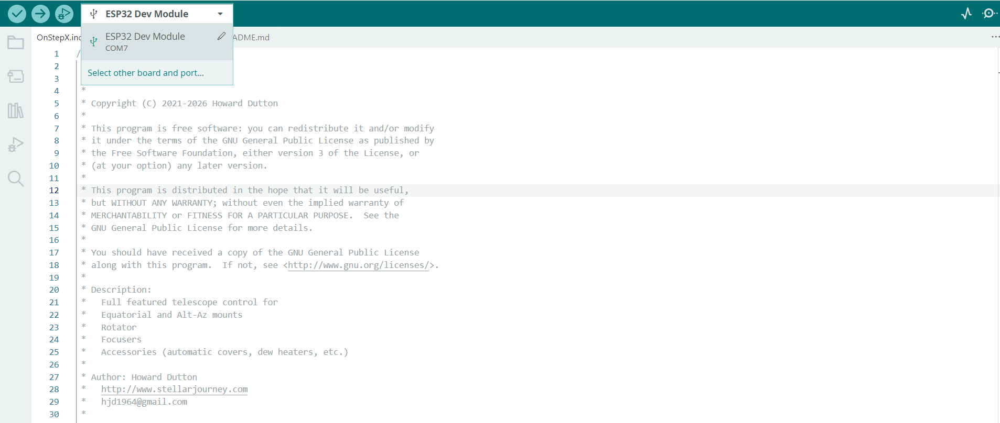

   Select your ESP32 variant and the COM port it's connected to (in this build: **ESP32 Dev Module** on **COM7**).

   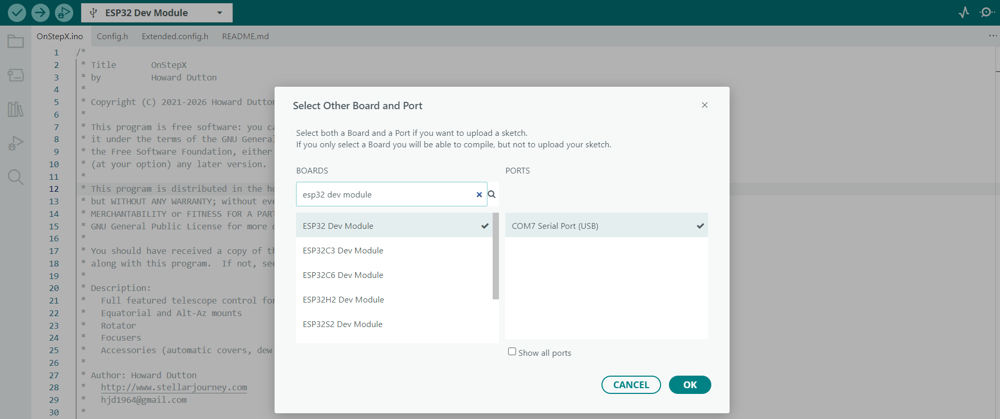

8. Click **Upload**.

   

9. **Verify the flash succeeded:** open the Serial Monitor, type `#GVP:`, and press Enter. A response of `Onstep` confirms the firmware flashed correctly.

## Step 2: Connecting the ESP32 to the OnStep Controller App

1. Once flashed, the ESP32 broadcasts its own Wi-Fi access point named **`OnStepX`**. Connect to it — the password is **`password`**.

2. Install **OnStep Controller2** from the Play Store and open it.

3. When prompted *"Would you like to create a new one now?"*, tap **Yes**.

   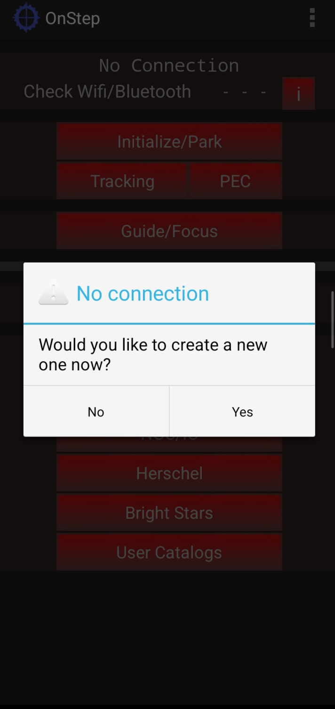

4. On the connection screen, enter the IP address **`192.168.0.1`** and tap **Accept**.

   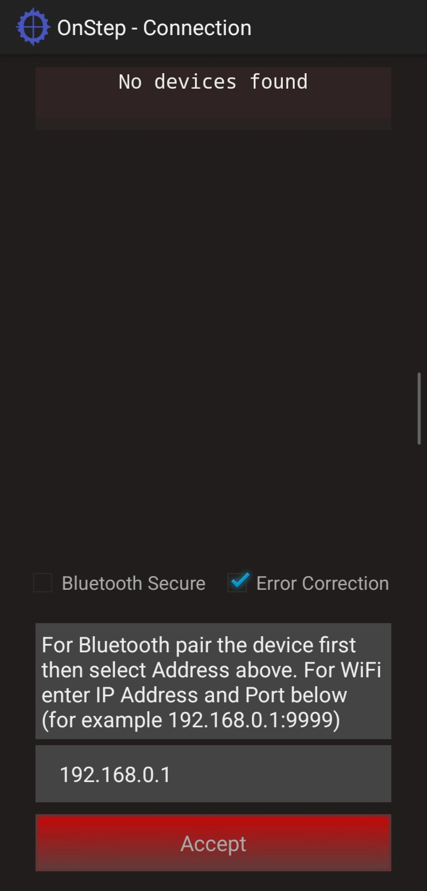

5. Wait a few seconds for the app to connect to the mount.

   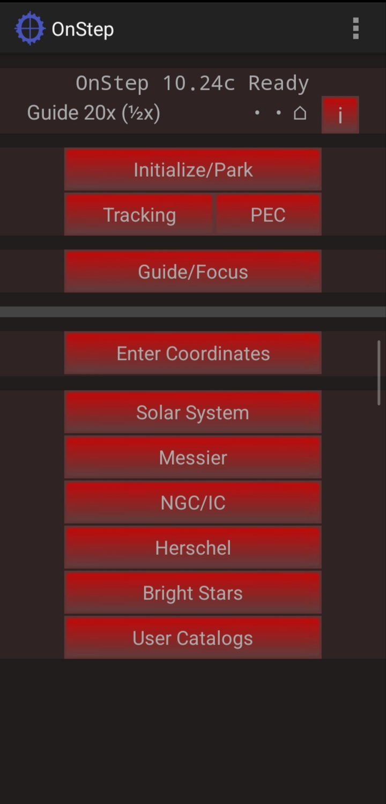

6. Tap the **three-dot menu** (top right) → **Observing Sites**, and enter your local **Latitude**, **Longitude**, and **UTC Offset**. Tap **Upload**, then return to the main menu.

   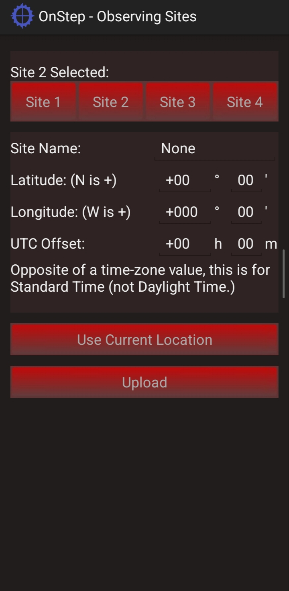

7. From the main menu, go to **Initialize/Park**. This is where most mount actions (park, unpark, home, goto) happen.

   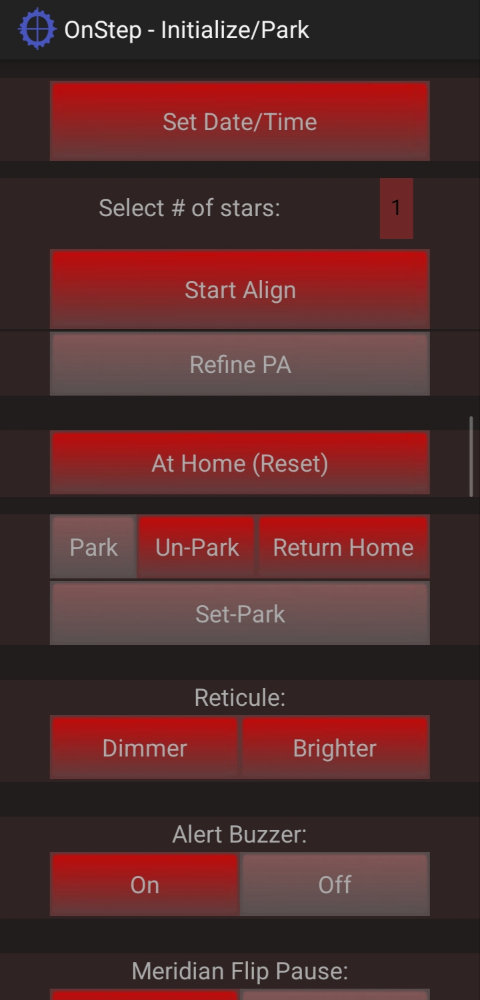

   > **Important:** Tap **Set Date/Time** before unparking. If this step is skipped, the mount won't accept any further commands.

Alternatively, the [Triton GoTo App](https://tritongoto.com/download) is worth trying — it includes a built-in planetarium view and has a more intuitive setup flow than the stock OnStep app.

## Step 3: Choosing a Motor Driver and Setting Vref

### A4988 vs. DRV8825

A NEMA17 stepper motor takes **200 full steps per revolution** (1.8° per step). Microstepping divides each full step into smaller increments for finer resolution:

| Driver | Max microsteps | Degrees per microstep | Steps per revolution |
|---|---|---|---|
| A4988 | 16 | 1.8° / 16 = 0.1125° | 3,200 |
| DRV8825 | 32 | 1.8° / 32 = 0.05625° | 6,400 |

Finer steps mean smoother, more precise tracking — important for accurately locating objects in the sky. This build started with an A4988 for initial testing, then upgraded to the **DRV8825** for higher resolution (and for a second reason covered in [Step 5](#step-5-designing-a-custom-pcb)).

### Setting the reference voltage (Vref)

Vref limits the current the driver delivers to the motor, protecting both the driver and the motor from damage.

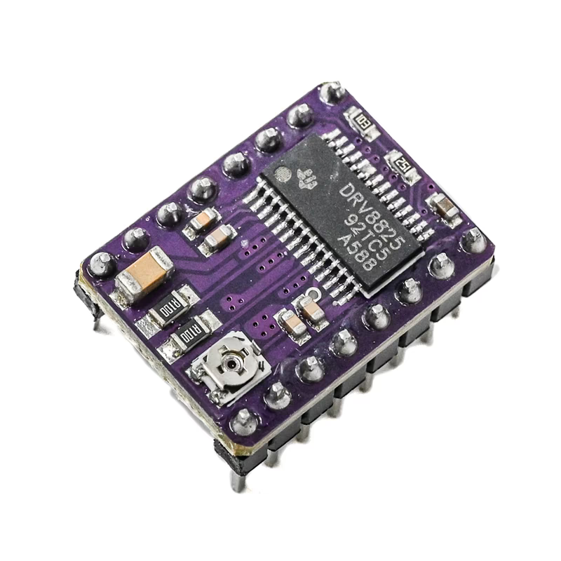

Vref is set using the small potentiometer on the driver board (turn carefully with a small screwdriver — it's easy to damage).

**Formula:**

```
Vref = Imax / 2
```

For the NEMA17 motor used here, `Imax = 1.2A` per phase:

```
Vref = 1.2 / 2 = 0.6V
```

For a safety margin, this build used **10% less**:

```
Vref = 0.5V
```

**To measure and set it:** power the driver with +5V (connect GND to GND, and FLT to +5V — the pinout may differ slightly by board, but this method works regardless). With the multimeter's red probe on the potentiometer and black probe on GND, adjust until the reading matches your target Vref.

If you run into trouble, [this YouTube tutorial](https://youtu.be/wcLeXXATCR4?si=PvDwpPcGoeFdWh77) walks through the process on an A4988 — the same steps apply to the DRV8825. The main difference is that the DRV8825 has a **FLT** pin where the A4988 has **VDD**. See the [DRV8825 connection notes](https://robu-prod-media.s3.ap-south-1.amazonaws.com/uploads/2017/12/Stepper-Motor-Driver-DRV8825-Power-Dissipitation-Considerations.pdf) for reference.

Datasheets: [DRV8825](https://robu-prod-media.s3.ap-south-1.amazonaws.com/uploads/2017/12/drv8825.pdf) · [A4988](https://robu-prod-media.s3.ap-south-1.amazonaws.com/uploads/2015/12/pololu_a4988-1.pdf)

## Step 4: Breadboard Testing

1. **Identify motor coil pairs.** On this motor, Red/Blue was Coil 1 and Green/Black was Coil 2 — verify yours with a multimeter or the tutorial linked above, since wire colors vary by motor.

2. **Find your ESP32 pinmap.** Inside the OnStepX folder, go to:

   ```
   OnStepX > src > pinmaps
   ```

   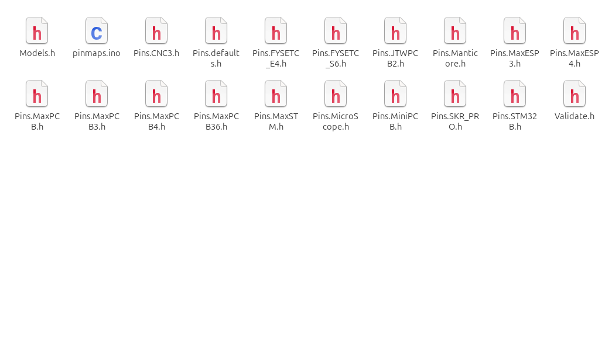

   Select the file matching your MCU — this build used **`Pins.MaxESP3.h`**.

   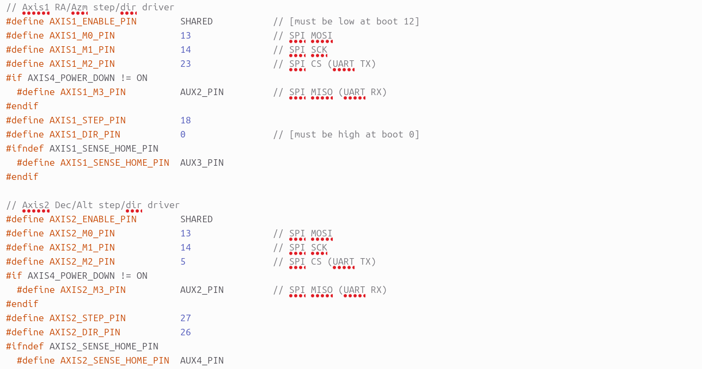

   Scroll to the **AXIS1** / **AXIS2** definitions and wire accordingly. Optional buzzer/LED status pins can also be added here.

3. **Wire the power stage.** Connect the 100µF electrolytic capacitor as shown in the [wiring video](https://youtu.be/wcLeXXATCR4?si=PvDwpPcGoeFdWh77) above. `VMOT` connects to **+12V**, and `FLT` connects to **+5V** — ideally from a step-down buck converter rather than the ESP32's own 5V rail.

   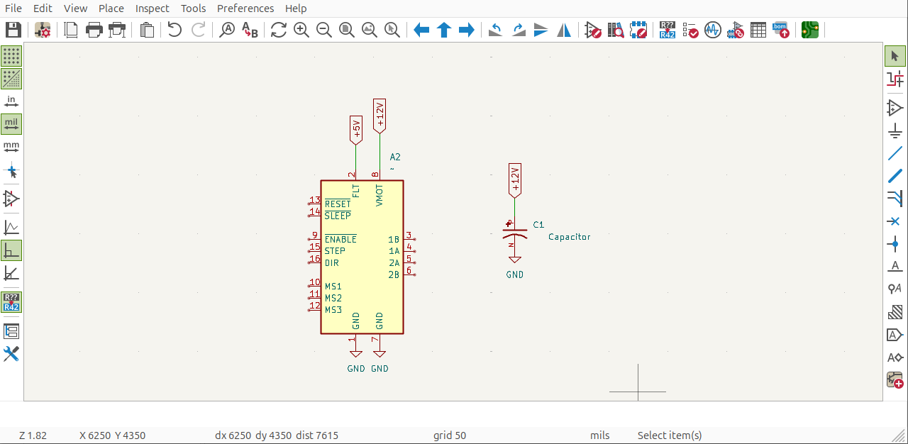

   This build used a **12V, 2A** supply.

4. **Test one axis at a time.** Wire and test **Axis 1 (RA)** first. Power on, connect the ESP32 via USB, open the OnStep app, and go to **Guide/Focus** to manually jog the motor and confirm it moves correctly in both directions.

   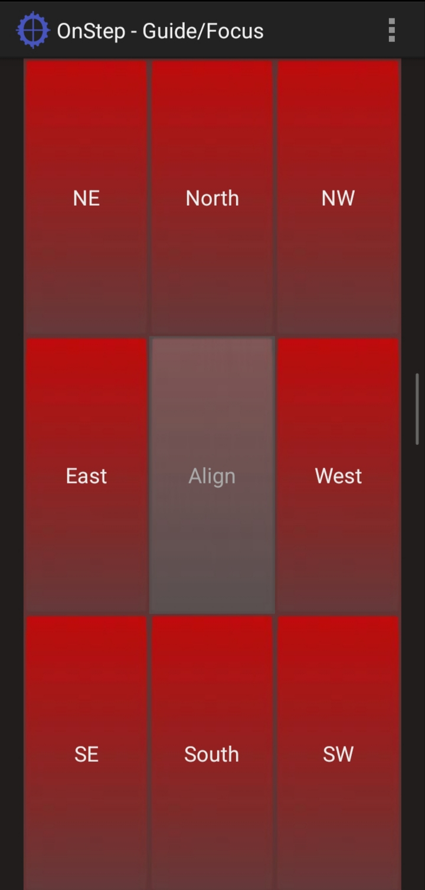

   Once Axis 1 works, repeat the same wiring and test process for **Axis 2 (Dec)**.

5. **Run both axes together** on the breadboard before moving to a permanent circuit.

   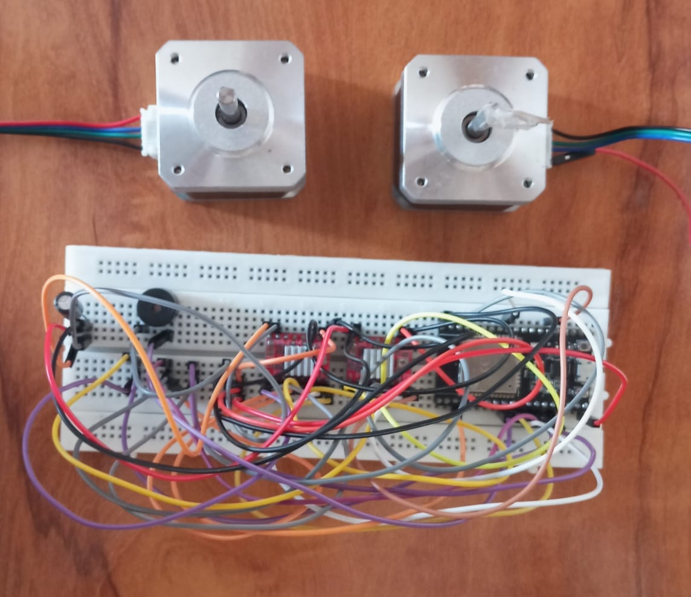

   > If motors behave erratically, check that the capacitor is installed and that the power supply is adequate. And if problems still persist there may be a fault with wiring itself. 

## Step 5: Designing a Custom PCB

The first PCB used for this build had an internal short at the 12V input hole, which cascaded into shorts across nearby resistors and capacitors — making the board unusable.

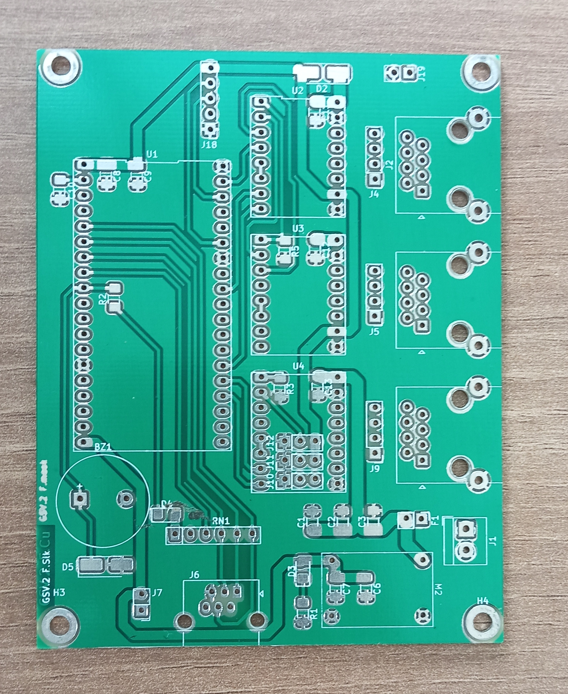

**What is a short?** A short circuit is an unintended low-resistance connection between two points (+12V and GND). This allows excessive current to flow, which can overheat and damage the circuit. A multimeter's continuity mode (which beeps when it detects a connection) is a fast way to check for shorts before powering anything on.

Since the original board was unrepairable, a **custom PCB** was designed from scratch in [KiCad](https://www.kicad.org/download/).

1. **Schematic** — includes the ESP32, A4988/DRV8825, and buck converter. Footprints for the ESP32 and driver were available online; the buck converter's footprint was custom-made by measuring the physical board.

   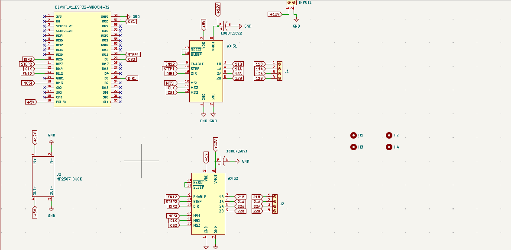

2. **PCB layout** — routed after the schematic was finalized.

   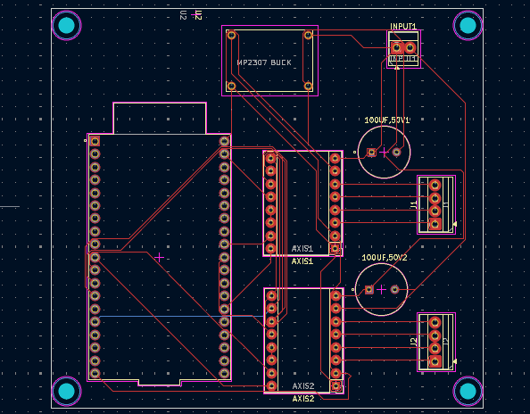

3. **3D preview** — used to sanity-check the layout before fabrication.

   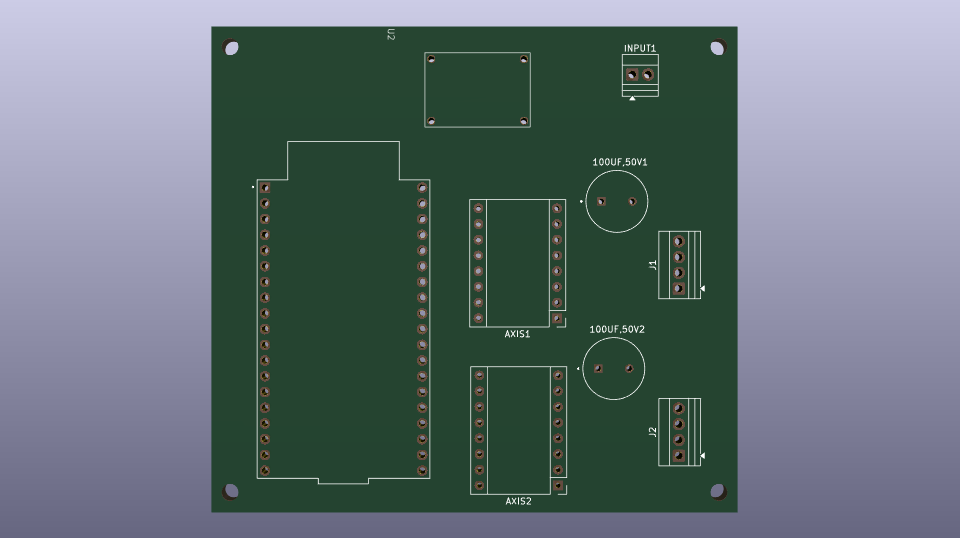

4. **Generate Gerber files:** `File > Fabrication Outputs > Gerbers (.gbr)`. Run **DRC** first to catch errors, then **Plot**, then **Save**.

   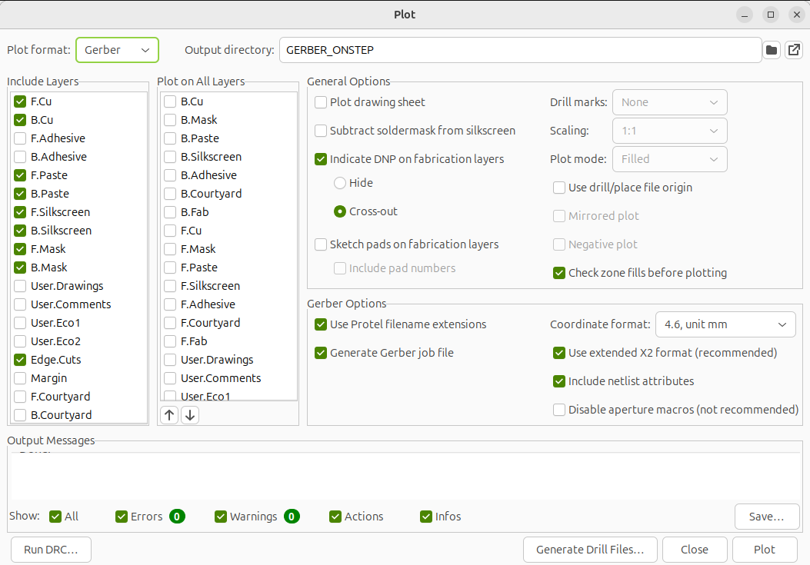

5. **Fabrication and assembly:**

   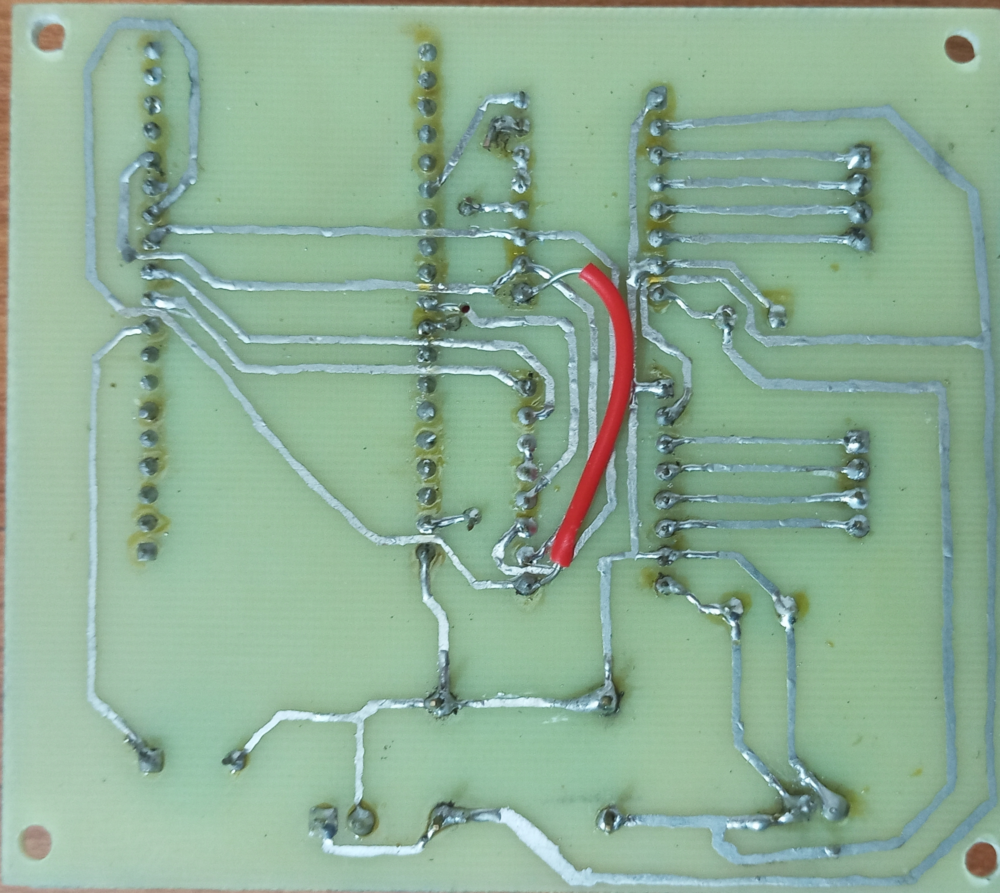

   This is a **single-sided** PCB — the underside shows the routed copper tracks. Three connections that couldn't be routed on one layer were completed with single-strand jumper wire.

   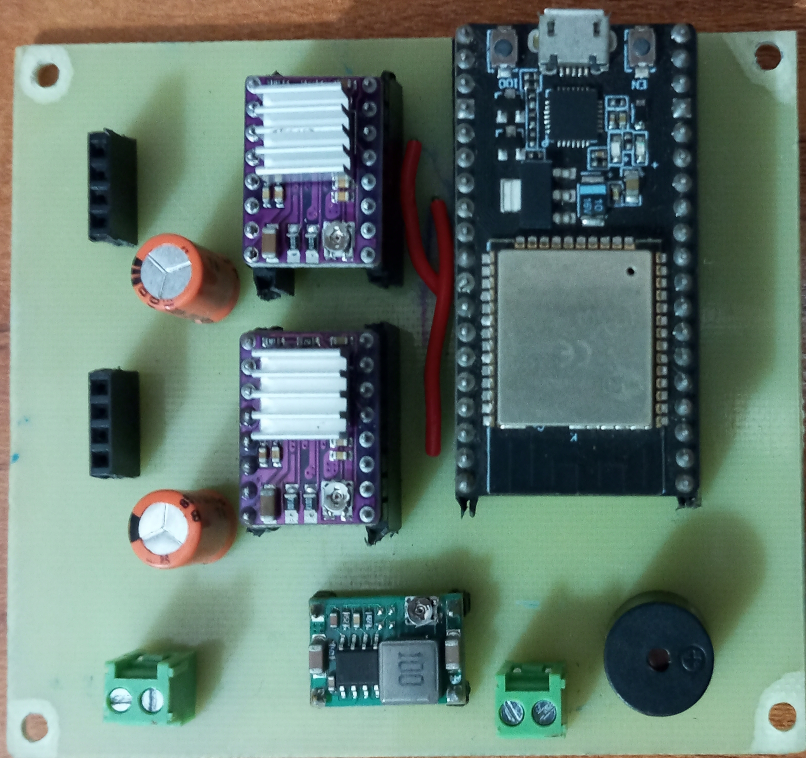

   Populated components: ESP32, DRV8825, step-down buck converter, active buzzer, and the 100µF electrolytic capacitor. Motor and power connectors are separate.

6. **Enclosure:** a custom case was 3D-printed to house the finished board.

   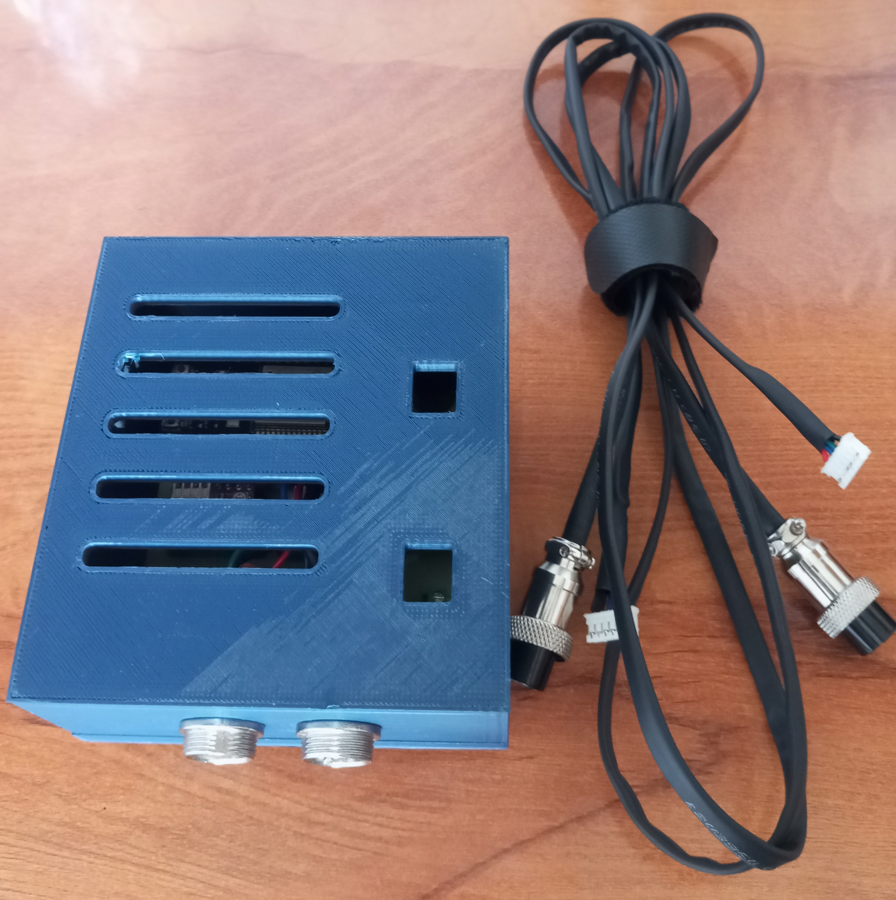

Motor driver connections to the NEMA17 use the motor's original connectors, soldered to 1-meter aviation connectors — long enough to avoid tension or interference around the mount.

## Step 6: Firmware Configuration

This is the step that matches the firmware's electrical and mechanical parameters to your specific hardware — arguably as important as the wiring itself.

1. Go to the [OnStep Configuration Generator](http://o.baheyeldin.com:1111/).

   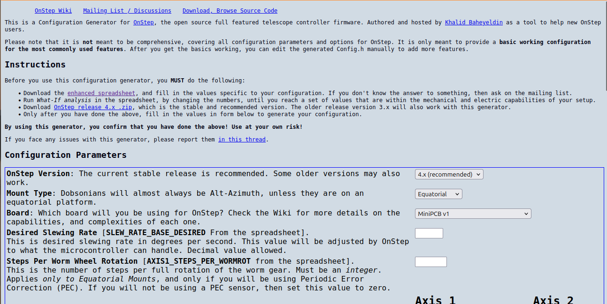
   *Credits: [Khalid Baheyeldin](https://www.progressiveautomations.com/)*

2. Download the **enhanced spreadsheet** it links to.

   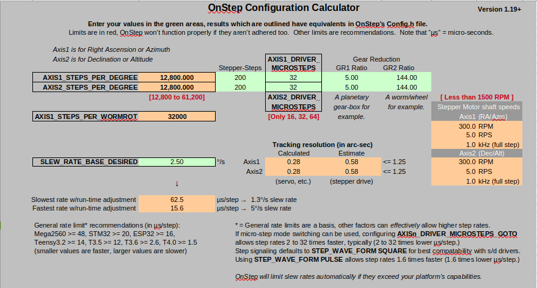

   This spreadsheet calculates the correct settings for your driver and gearing. Key fields:

   | Field | What it means | Value used in this build |
   |---|---|---|
   | **Stepper Steps** | Full steps per motor revolution (check your motor's datasheet) | 200 (NEMA17) |
   | **AXIS1/2_DRIVER_MICROSTEPS** | Maximum microsteps your driver supports | 32 (DRV8825) |
   | **GR2 Ratio** | Number of teeth on the mount's worm wheel | 144 (EQ4) |
   | **GR1 Ratio** | Pulley gear ratio (large pulley teeth ÷ small pulley teeth) | 5 (60T / 12T) |

3. **Checking if your gear ratio is sufficient:**

   ```
   Steps per degree = (Stepper Steps × Microsteps × GR1 × GR2) / 360
   ```

   With a DRV8825 (32 microsteps) and GR1 = 5:

   ```
   (200 × 32 × 5 × 144) / 360 = 12,800 steps/degree
   ```

   With an A4988 (16 microsteps), a **higher GR1 (≥10)** is needed to hit a comparable resolution:

   ```
   (200 × 16 × 10 × 144) / 360 = 12,800 steps/degree
   ```

   Higher steps-per-degree means finer, more precise tracking resolution. Choose your driver's microstep setting and GR1 ratio together based on the resolution you need.

4. Fill in only the fields relevant to your hardware in the spreadsheet, leaving the rest at default, then return to the generator site and click **Generate**. This produces a `Config.h` file — copy it into your `OnStepX` folder (where the `.ino` file lives), replacing the existing `Config.h` when prompted.

## Step 7: Setting Up the Web Server Plugin

OnStepX supports an optional web-based control interface via a plugin.

1. Download the plugin from the [OnStepX-Plugins repository](https://github.com/hjd1964/OnStepX-Plugins/tree/v1.0a).

   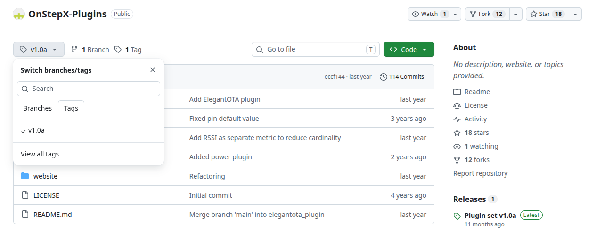
   *Credits: [hjd1964](https://github.com/hjd1964)*

   > This build uses tag **v1.0a** specifically — the `main` branch had errors at the time of writing.

2. Extract the download and copy the `website` folder into:

   ```
   OnStepX > src > plugins
   ```

3. Open **`Plugins.config.h`** and add:

   ```cpp
   #define PLUGIN1 website
   #include "website/Website.h"
   ```

4. In **`Config.h`**, just below the `PINMAPS` section under **SERIAL PORT COMMAND CHANNELS**, add:

   ```cpp
   #define SERIAL_RADIO WIFI_ACCESS_POINT
   ```

5. In **`Extended.config.h`**, near the end of the file, add:

   ```cpp
   #define SERIAL_IP_MODE WIFI_ACCESS_POINT
   #define WEB_SERVER on
   ```

6. Save both files and reflash the ESP32. Connect to its Wi-Fi network, then open a browser to **`192.168.0.1`** to reach the OnStepX web interface.

**Web interface screens:**

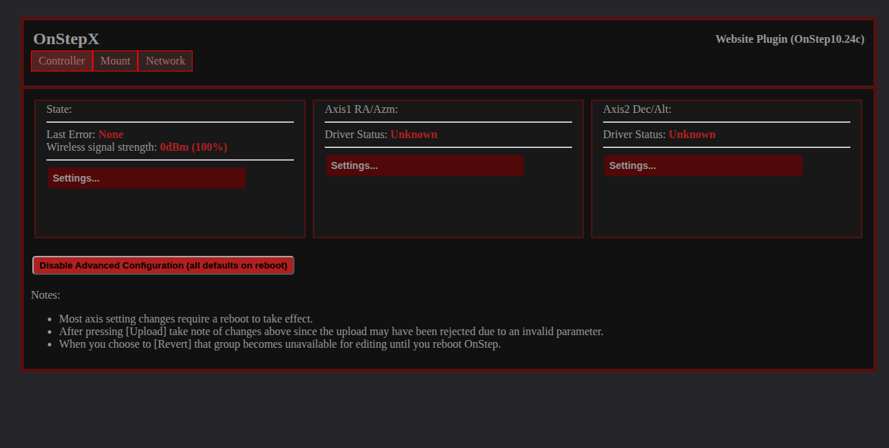

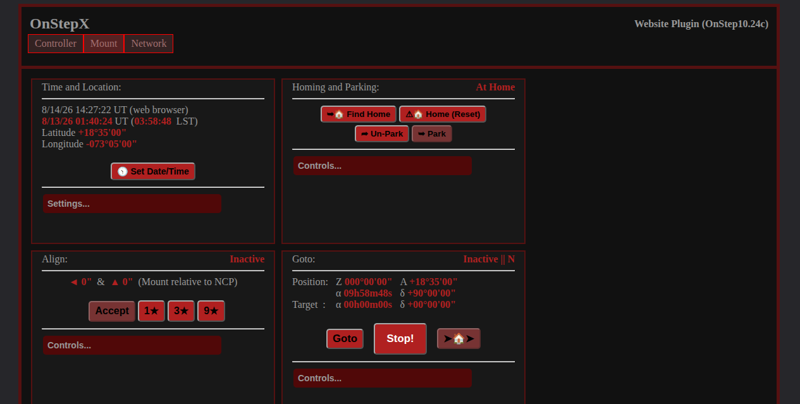

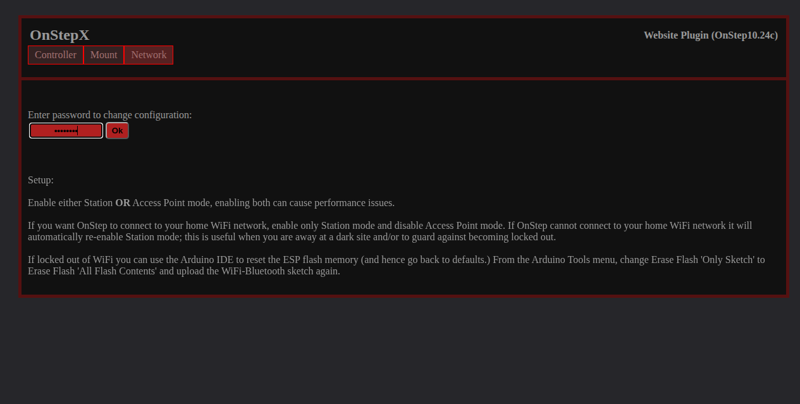

Opening the **Network** tab prompts for a password — again, it's **`password`** by default.

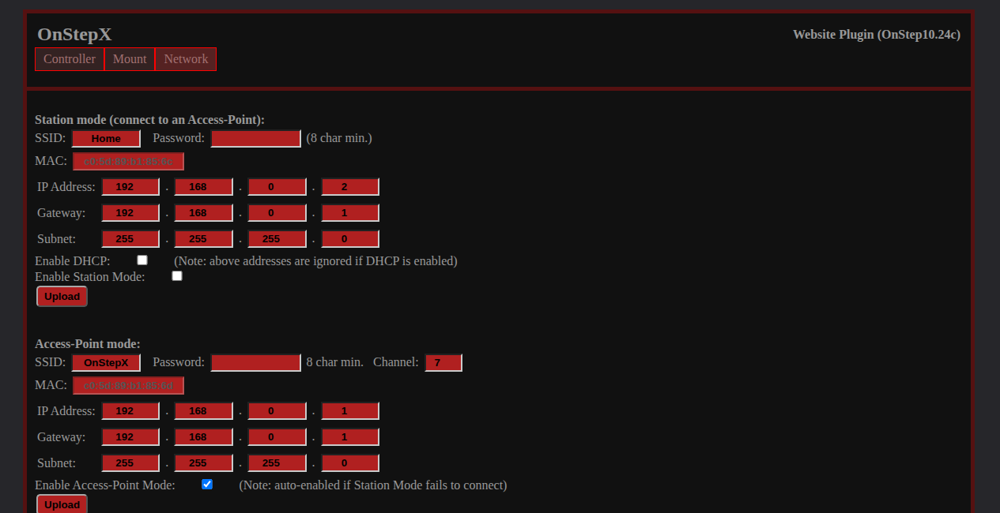

## Step 8: Servicing the Mount and Fitting Motor Brackets

This build is based on a stock **EQ4** mount.

Before adding any electronics, the mount was fully disassembled and inspected:

- Checked all parts for wear.
- Cleaned old grease buildup off the worm wheel and worm shaft.
- Re-greased the gears for smooth movement.
- Reassembled and adjusted the worm shaft tension screws until it turned with even, moderate resistance (neither too loose nor too tight).
- Verified smooth manual movement before adding any motorized components.

### Fitting motor brackets

Some mounts — like the **Explore Scientific EXOS2** with a OnStep kit — have screw holes purpose-built for motor brackets:

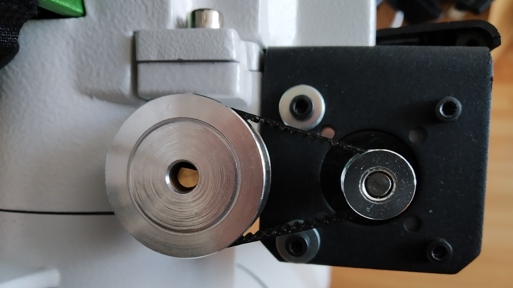
*Credits: [Phobos Astronomy](https://phobos-astronomy.netlify.app/)*

The EQ4 used in this build has **no such mounting points**, so brackets couldn't be bolted on directly. The workaround:

1. A **solid steel angle** was custom-made at a local weld shop, sized to bear the motor's weight.
2. The angle was ground to fit the Dec axis, then drilled to match the screw pattern (washers recommended if hole alignment isn't perfect).
3. The modified steel angle was welded to the motor bracket. This was repeated for **both the RA and Dec axes**.

### Belt and pulley fitment

Per the [Configuration](#step-6-firmware-configuration) step, this build uses a **5:1** gear ratio: a 60-tooth GT2 pulley on the worm shaft and a 12-tooth GT2 pulley on the motor. See the [OnStep Drive Design wiki](https://onstep.groups.io/g/main/wiki/16264) for guidance on choosing pulleys and belts for your own ratio.

An open-loop belt was tried first (cut to length and joined with super glue) since the correct closed-loop length wasn't known in advance — this didn't hold up, but it confirmed the needed belt length. A **180mm closed-loop GT2 belt** was ordered afterward.

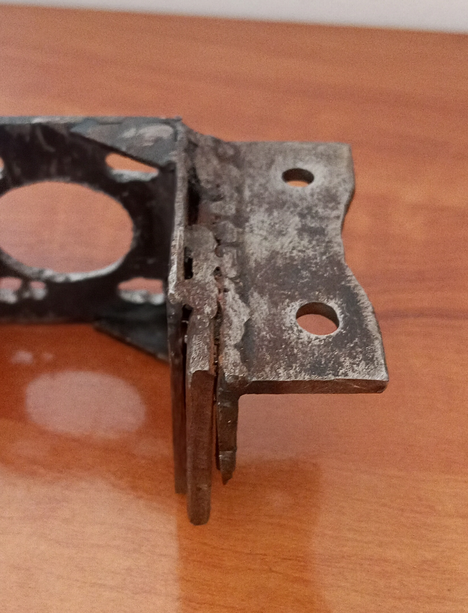

The belt ended up **4mm too long** for the pulley spacing; a 4mm spacer plate was added between the steel angle and the bracket to compensate.

The bracket holes were also enlarged into **oblong slots**, allowing the motor to slide and adjust belt tension:

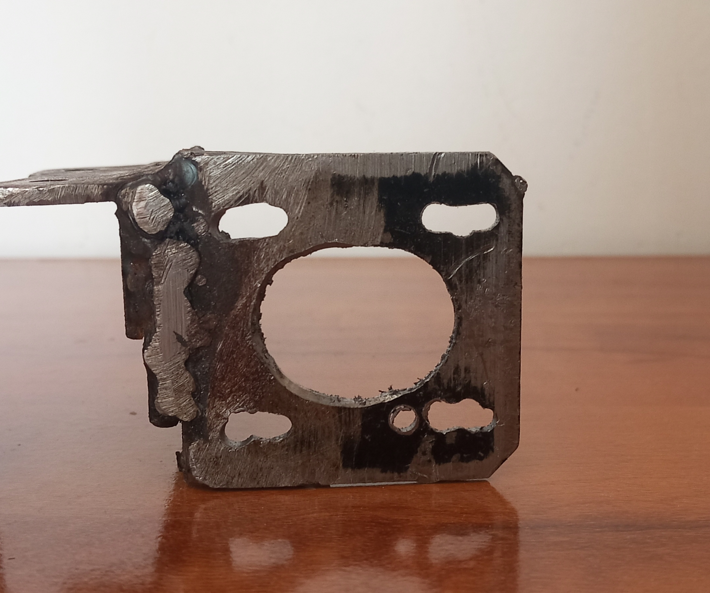

Final assembled Dec axis:

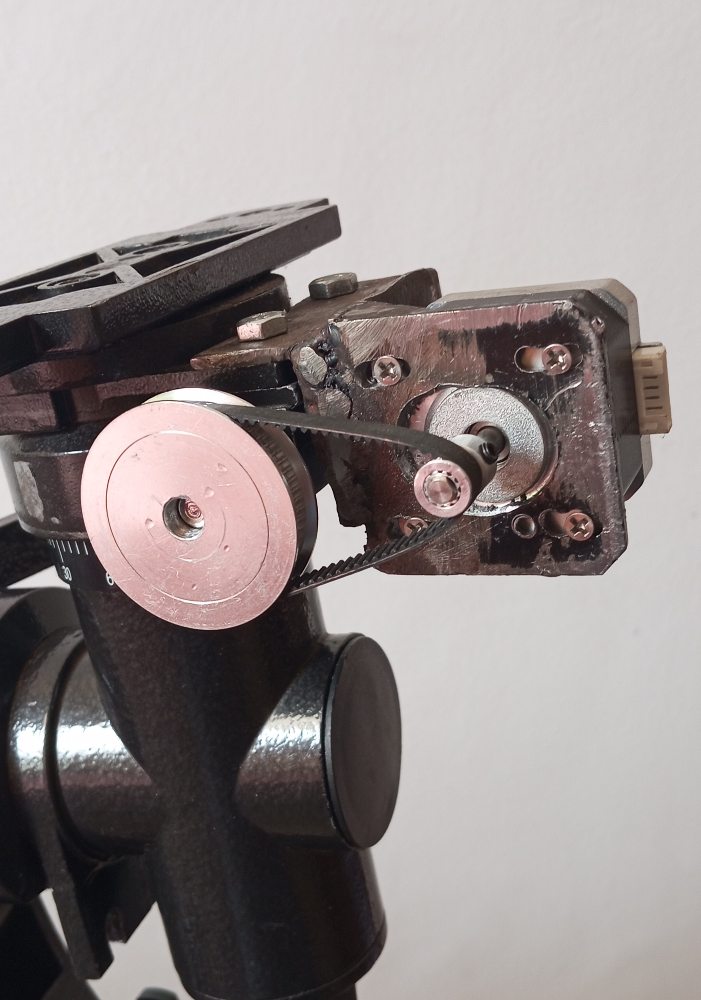

The same process was repeated for the RA axis.

## Safety Notes

- This build involves mains-adjacent DC power (12V @ up to 5A) and exposed PCB traces. Always double-check polarity and use a multimeter in continuity mode before powering on a new circuit for the first time.
- Set Vref **before** connecting a motor — an incorrectly set or unset Vref can damage the driver or motor.
- Never hot-plug motor connectors while the driver is powered.
- Handle the worm shaft and gear tension carefully — over-tightening can strip the wheel or bind the axis motor.

## Credits

- [**hjd1964**](https://github.com/hjd1964) — OnStepX firmware and plugin repositories
- [**Khalid Baheyeldin**](https://www.progressiveautomations.com/) — OnStep Configuration Generator
- [**Phobos Astronomy**](https://phobos-astronomy.netlify.app/) — EXOS2 bracket reference photo
- [OnStep community wiki](https://onstep.groups.io/g/main/wiki/3860) — general OnStep documentation

## Additional Photos & Videos

More photos and testing videos (breadboard testing, PCB assembly, and mount tracking tests) are available here:

📁 **[Google Drive — Photos & Videos](https://tinyurl.com/42mazz7c)


## Status / Next Steps

Both axes are wired, mechanically mounted, and configured. Remaining work / not yet documented here:
- End-to-end GoTo accuracy testing (polar alignment + star-based accuracy check).
- Final photos and video of the fully assembled mount in operation.

---

**Hardware used in this build:** EQ4 mount · ESP32 · DRV8825 · NEMA17 steppers · Custom KiCad PCB · OnStepX 10.24

## Note

This project uses v10.24 of OnStepX. All the changes mentioned above are present in files provided.
